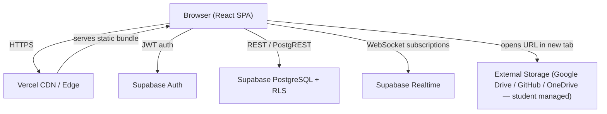

# Design Document

## DAI-PMS — Department of Artificial Intelligence Project Management System

> Powered by: Prof. Dr. Najia Saher (Chairperson), Department of Artificial Intelligence, Faculty of Computing, The Islamia University of Bahawalpur
> Developed by: Mr. Muzammil Ur Rehman (Lecturer), Department of Artificial Intelligence, Faculty of Computing, The Islamia University of Bahawalpur
> © Department of Artificial Intelligence, Faculty of Computing, The Islamia University of Bahawalpur, Pakistan. All rights reserved.

---

## Overview

DAI-PMS is a React + TypeScript SPA that manages the Final Year Project lifecycle for BS AI students at IUB. It covers two semesters — FYP-I (7th, 3 credit hours) and FYP-II (8th, 3 credit hours) — across three roles: Department_Admin, Supervisor, and Student.

The system is built on:
- **Frontend**: React 18 + TypeScript + Vite, Tailwind CSS (mobile-first), Lucide icons, Google Fonts
- **Backend**: Supabase (PostgreSQL, Auth, Realtime, RLS) — no file storage required
- **Deployment**: Vercel (SPA with `vercel.json` rewrite for client-side routing)

Key design principles:
- All access control is enforced at two layers: React route guards (UI) and Supabase RLS policies (database).
- Session and Section are always selected via UI dropdowns; they are never inferred from CSV content.
- The three sort comparators (`compareRegNumbers`, `compareSectionNames`, `compareSessionNames`) in `src/utils/formatters.ts` are the single source of truth for all ordering throughout the app.
- First-login password change is mandatory and blocks all dashboard routes until completed.
- Document submissions use externally hosted URLs (Google Drive, GitHub, OneDrive, etc.); the system stores only the URL — no file uploads, no Supabase Storage.

---

## Architecture



### Request Flow

1. User loads the SPA from Vercel.
2. Supabase Auth issues a JWT on login; the JWT is stored in `localStorage` by the Supabase JS client.
3. Every database query goes through PostgREST with the JWT attached; RLS policies evaluate the JWT claims to enforce row-level access.
4. Realtime subscriptions (messages, notifications, dashboard updates) use Supabase Realtime channels over WebSocket.
5. Document submissions store only a URL in the `submission_versions` table. The supervisor clicks the URL to open the document in a new browser tab. No files are uploaded to or stored in Supabase.

### Routing

Client-side routing via React Router v6. Route groups:

| Path prefix | Guard | Description |
|---|---|---|
| `/login` | public | Login page |
| `/first-login` | authenticated + `password_changed = false` | Mandatory password change |
| `/admin/*` | `role = Department_Admin` + `password_changed = true` | Admin dashboard |
| `/supervisor/*` | `role = Supervisor` + `password_changed = true` | Supervisor dashboard |
| `/student/*` | `role = Student` + `password_changed = true` | Student dashboard |

A `<ProtectedRoute>` component wraps each group and redirects to `/first-login` if `password_changed = false`, or to `/login` if unauthenticated.

---

## Components and Interfaces

### Directory Structure

```
src/
  assets/                  # static images, logo
  components/
    ui/                    # reusable primitives (Button, Input, Modal, Badge, Table, etc.)
    layout/                # AppShell, Sidebar, Navbar, NotificationBell
    auth/                  # LoginForm, FirstLoginForm, ProtectedRoute
    admin/                 # SessionForm, SectionForm, StudentForm, SupervisorForm,
                           # AssignmentForm, DeadlineManager, MarksReport, SeedImport
    supervisor/            # SupervisorDashboard, SubmissionEvaluator, MeetingManager,
                           # CommentThread, ChatWindow
    student/               # StudentDashboard, SubmissionURLForm, CommentThread, ChatWindow
    shared/                # SortFilterBar, Pagination, CSVUploader, NotificationList
  hooks/
    useAuth.ts             # current user, role, password_changed
    useRealtimeChannel.ts  # generic Supabase Realtime subscription
    useNotifications.ts    # unread count + list
  pages/
    LoginPage.tsx
    FirstLoginPage.tsx
    admin/                 # SessionsPage, SectionsPage, StudentsPage, SupervisorsPage,
                           # AssignmentsPage, DeadlinesPage, ReportsPage
    supervisor/            # DashboardPage, SubmissionsPage, MeetingsPage, ChatPage
    student/               # DashboardPage, SubmissionsPage, ChatPage
  services/
    supabase.ts            # Supabase client singleton
    auth.service.ts        # login, logout, resetPassword, changePassword
    sessions.service.ts
    sections.service.ts
    students.service.ts
    supervisors.service.ts
    assignments.service.ts
    submissions.service.ts
    meetings.service.ts
    comments.service.ts
    messages.service.ts
    notifications.service.ts
    grades.service.ts
    export.service.ts      # CSV export
    seed.service.ts        # CSV import / seed processing
  utils/
    formatters.ts          # compareRegNumbers(), compareSectionNames(), compareSessionNames()
    grading.ts             # computeGrade(), computeTotal()
    csv.ts                 # parseCSV(), validateRow()
  types/
    index.ts               # all shared TypeScript interfaces
  router.tsx               # React Router configuration
  App.tsx
  main.tsx
```

### Key Component Interfaces

```typescript
// ProtectedRoute
interface ProtectedRouteProps {
  allowedRole: 'Department_Admin' | 'Supervisor' | 'Student';
  children: React.ReactNode;
}

// SortFilterBar (generic)
interface SortFilterBarProps<T> {
  fields: SortField<T>[];
  filters: FilterConfig[];
  onSortChange: (field: keyof T, direction: 'asc' | 'desc') => void;
  onFilterChange: (filters: Record<string, string>) => void;
}

// CSVUploader
interface CSVUploaderProps {
  columns: string[];
  onParsed: (rows: Record<string, string>[]) => void;
  onError: (errors: RowError[]) => void;
}
```

---

## Data Models

### Supabase Schema (PostgreSQL)

```sql
-- Profiles (extends Supabase Auth users)
CREATE TABLE profiles (
  id            UUID PRIMARY KEY REFERENCES auth.users(id) ON DELETE CASCADE,
  role          TEXT NOT NULL CHECK (role IN ('Department_Admin','Supervisor','Student')),
  password_changed BOOLEAN NOT NULL DEFAULT FALSE,
  created_at    TIMESTAMPTZ NOT NULL DEFAULT NOW()
);

-- Sessions
CREATE TABLE sessions (
  id            UUID PRIMARY KEY DEFAULT gen_random_uuid(),
  session_name  TEXT NOT NULL UNIQUE,  -- e.g. "2026 Spring"
  created_at    TIMESTAMPTZ NOT NULL DEFAULT NOW()
);

-- Semesters (auto-created: 7 and 8 per session)
CREATE TABLE semesters (
  id              UUID PRIMARY KEY DEFAULT gen_random_uuid(),
  session_id      UUID NOT NULL REFERENCES sessions(id) ON DELETE CASCADE,
  semester_number INT  NOT NULL CHECK (semester_number IN (7, 8)),
  UNIQUE (session_id, semester_number)
);

-- Sections
CREATE TABLE sections (
  id           UUID PRIMARY KEY DEFAULT gen_random_uuid(),
  session_id   UUID NOT NULL REFERENCES sessions(id) ON DELETE CASCADE,
  section_name TEXT NOT NULL,
  UNIQUE (session_id, section_name)
);

-- Supervisors
CREATE TABLE supervisors (
  id            UUID PRIMARY KEY REFERENCES auth.users(id) ON DELETE CASCADE,
  teacher_name  TEXT NOT NULL,
  designation   TEXT NOT NULL,
  expertise     TEXT,
  mobile_number TEXT,
  email         TEXT NOT NULL UNIQUE,
  created_at    TIMESTAMPTZ NOT NULL DEFAULT NOW()
);

-- Students
CREATE TABLE students (
  id            UUID PRIMARY KEY REFERENCES auth.users(id) ON DELETE CASCADE,
  reg_number    TEXT NOT NULL UNIQUE,
  student_name  TEXT NOT NULL,
  father_name   TEXT,
  mobile_number TEXT,
  email         TEXT NOT NULL UNIQUE,
  section_id    UUID NOT NULL REFERENCES sections(id),
  created_at    TIMESTAMPTZ NOT NULL DEFAULT NOW()
);

-- Supervisor Assignments (per session)
CREATE TABLE assignments (
  id            UUID PRIMARY KEY DEFAULT gen_random_uuid(),
  session_id    UUID NOT NULL REFERENCES sessions(id) ON DELETE CASCADE,
  supervisor_id UUID NOT NULL REFERENCES supervisors(id),
  student_id    UUID NOT NULL REFERENCES students(id),
  section_id    UUID NOT NULL REFERENCES sections(id),
  UNIQUE (session_id, student_id)  -- one supervisor per student per session
);

-- Submission Deadlines (per semester, per submission type)
CREATE TABLE submission_deadlines (
  id               UUID PRIMARY KEY DEFAULT gen_random_uuid(),
  semester_id      UUID NOT NULL REFERENCES semesters(id) ON DELETE CASCADE,
  submission_type  TEXT NOT NULL CHECK (submission_type IN (
                     'Project Approval','SRS','SDD',
                     'Final Documentation','Final Project Code')),
  is_locked        BOOLEAN NOT NULL DEFAULT TRUE,
  deadline         TIMESTAMPTZ,
  UNIQUE (semester_id, submission_type)
);

-- Submissions (one per student per submission_type per semester)
CREATE TABLE submissions (
  id               UUID PRIMARY KEY DEFAULT gen_random_uuid(),
  student_id       UUID NOT NULL REFERENCES students(id),
  semester_id      UUID NOT NULL REFERENCES semesters(id),
  submission_type  TEXT NOT NULL,
  status           TEXT NOT NULL DEFAULT 'Pending'
                     CHECK (status IN ('Pending','Approved','Rejected','Revision')),
  marks            INT  NOT NULL DEFAULT 0,
  created_at       TIMESTAMPTZ NOT NULL DEFAULT NOW(),
  updated_at       TIMESTAMPTZ NOT NULL DEFAULT NOW(),
  UNIQUE (student_id, semester_id, submission_type)
);

-- Submission Versions (full URL history — no file storage)
CREATE TABLE submission_versions (
  id            UUID PRIMARY KEY DEFAULT gen_random_uuid(),
  submission_id UUID NOT NULL REFERENCES submissions(id) ON DELETE CASCADE,
  document_url  TEXT NOT NULL,          -- externally hosted URL provided by student
  submitted_at  TIMESTAMPTZ NOT NULL DEFAULT NOW()
);

-- Meetings
CREATE TABLE meetings (
  id            UUID PRIMARY KEY DEFAULT gen_random_uuid(),
  supervisor_id UUID NOT NULL REFERENCES supervisors(id),
  semester_id   UUID NOT NULL REFERENCES semesters(id),
  scope         TEXT NOT NULL CHECK (scope IN ('Individual','Group','All')),
  status        TEXT NOT NULL DEFAULT 'Approved'
                  CHECK (status IN ('Approved','Rejected','Re-scheduled')),
  scheduled_at  TIMESTAMPTZ NOT NULL,
  created_at    TIMESTAMPTZ NOT NULL DEFAULT NOW()
);

-- Meeting Participants
CREATE TABLE meeting_participants (
  id          UUID PRIMARY KEY DEFAULT gen_random_uuid(),
  meeting_id  UUID NOT NULL REFERENCES meetings(id) ON DELETE CASCADE,
  student_id  UUID NOT NULL REFERENCES students(id),
  marks       INT  NOT NULL DEFAULT 0,
  UNIQUE (meeting_id, student_id)
);

-- Comments
CREATE TABLE comments (
  id            UUID PRIMARY KEY DEFAULT gen_random_uuid(),
  submission_id UUID NOT NULL REFERENCES submissions(id) ON DELETE CASCADE,
  author_id     UUID NOT NULL REFERENCES profiles(id),
  body          TEXT NOT NULL,
  created_at    TIMESTAMPTZ NOT NULL DEFAULT NOW()
);

-- Messages
CREATE TABLE messages (
  id            UUID PRIMARY KEY DEFAULT gen_random_uuid(),
  sender_id     UUID NOT NULL REFERENCES profiles(id),
  recipient_id  UUID NOT NULL REFERENCES profiles(id),
  body          TEXT NOT NULL,
  created_at    TIMESTAMPTZ NOT NULL DEFAULT NOW()
);

-- Notifications
CREATE TABLE notifications (
  id          UUID PRIMARY KEY DEFAULT gen_random_uuid(),
  user_id     UUID NOT NULL REFERENCES profiles(id),
  type        TEXT NOT NULL,
  payload     JSONB,
  is_read     BOOLEAN NOT NULL DEFAULT FALSE,
  created_at  TIMESTAMPTZ NOT NULL DEFAULT NOW()
);
```

### TypeScript Types (`src/types/index.ts`)

```typescript
export type Role = 'Department_Admin' | 'Supervisor' | 'Student';
export type SubmissionType = 'Project Approval' | 'SRS' | 'SDD' | 'Final Documentation' | 'Final Project Code';
export type SubmissionStatus = 'Pending' | 'Approved' | 'Rejected' | 'Revision';
export type MeetingScope = 'Individual' | 'Group' | 'All';
export type MeetingStatus = 'Approved' | 'Rejected' | 'Re-scheduled';

export interface Session { id: string; session_name: string; created_at: string; }
export interface Semester { id: string; session_id: string; semester_number: 7 | 8; }
export interface Section { id: string; session_id: string; section_name: string; }
export interface Student {
  id: string; reg_number: string; student_name: string;
  father_name: string | null; mobile_number: string | null;
  email: string; section_id: string;
}
export interface Supervisor {
  id: string; teacher_name: string; designation: string;
  expertise: string | null; mobile_number: string | null; email: string;
}
export interface Assignment {
  id: string; session_id: string; supervisor_id: string;
  student_id: string; section_id: string;
}
export interface SubmissionDeadline {
  id: string; semester_id: string; submission_type: SubmissionType;
  is_locked: boolean; deadline: string | null;
}
export interface Submission {
  id: string; student_id: string; semester_id: string;
  submission_type: SubmissionType; status: SubmissionStatus;
  marks: number; created_at: string; updated_at: string;
}
export interface SubmissionVersion {
  id: string; submission_id: string; document_url: string; submitted_at: string;
}
export interface Meeting {
  id: string; supervisor_id: string; semester_id: string;
  scope: MeetingScope; status: MeetingStatus; scheduled_at: string;
}
export interface MeetingParticipant {
  id: string; meeting_id: string; student_id: string; marks: number;
}
export interface Comment {
  id: string; submission_id: string; author_id: string;
  body: string; created_at: string;
}
export interface Message {
  id: string; sender_id: string; recipient_id: string;
  body: string; created_at: string;
}
export interface Notification {
  id: string; user_id: string; type: string;
  payload: Record<string, unknown> | null; is_read: boolean; created_at: string;
}
```

### Grading Logic (`src/utils/grading.ts`)

```typescript
// FYP-I max marks: Project Approval 20 + SRS 30 + SDD 30 + Meetings 20 = 100
// FYP-II max marks: Final Documentation 40 + Final Project Code 40 + Meetings 20 = 100

export function computeGrade(total: number): string {
  if (total >= 95) return 'A+';
  if (total >= 85) return 'A';
  if (total >= 78) return 'B+';
  if (total >= 70) return 'B';
  if (total >= 60) return 'C';
  if (total >= 50) return 'D';
  return 'F';
}
```

### Sort Comparators (`src/utils/formatters.ts`)

```typescript
// compareRegNumbers: sort by (year asc, S<F, program 1<2<7, M<E, serial asc)
// compareSectionNames: sort by (semester number asc, section number asc, M<E)
// compareSessionNames: sort by (year asc, Spring<Fall)
// All three fall back to localeCompare on parse failure — no errors thrown.
```

### Submission Sequence Enforcement

FYP-I sequence: `Project Approval → SRS → SDD`
FYP-II sequence: `Final Documentation → Final Project Code`

A student may only upload to the next unlocked submission type in sequence. The system checks:
1. The `submission_deadlines` row for the type is `is_locked = false` and `deadline > NOW()`.
2. All preceding types in the sequence are `Approved`.

### Marks Allocation

| Submission Type | Max Marks | Semester |
|---|---|---|
| Project Approval | 20 | FYP-I |
| SRS | 30 | FYP-I |
| SDD | 30 | FYP-I |
| Meetings | 20 | FYP-I & FYP-II |
| Final Documentation | 40 | FYP-II |
| Final Project Code | 40 | FYP-II |

Meeting marks: 2 per Approved meeting, max 10 meetings = 20 marks per semester.

### RLS Policy Summary

| Table | Department_Admin | Supervisor | Student |
|---|---|---|---|
| sessions, semesters, sections | full CRUD | SELECT | SELECT |
| students, supervisors | full CRUD | SELECT (assigned) | SELECT (self) |
| assignments | full CRUD | SELECT (own) | SELECT (self) |
| submission_deadlines | full CRUD | SELECT | SELECT |
| submissions, submission_versions | full CRUD | SELECT + UPDATE (assigned) | SELECT + INSERT (own) |
| meetings, meeting_participants | full CRUD | full CRUD (own) | SELECT (own) |
| comments | full CRUD | INSERT + SELECT (assigned) | INSERT + SELECT (own) |
| messages | full CRUD | INSERT + SELECT (own conversations) | INSERT + SELECT (own conversations) |
| notifications | full CRUD | SELECT + UPDATE (own) | SELECT + UPDATE (own) |
| profiles | full CRUD | SELECT + UPDATE (own) | SELECT + UPDATE (own) |


---

## Correctness Properties

*A property is a characteristic or behavior that should hold true across all valid executions of a system — essentially, a formal statement about what the system should do. Properties serve as the bridge between human-readable specifications and machine-verifiable correctness guarantees.*

---

### Property 1: Session name format validation

*For any* string, the session name validator should accept it if and only if it matches the pattern `[YYYY] [Spring|Fall]` (four-digit year, single space, then exactly "Spring" or "Fall").

**Validates: Requirements 1.1**

---

### Property 2: Session creation auto-creates two semesters

*For any* newly created session, exactly two semester records should be associated with it — one with `semester_number = 7` and one with `semester_number = 8`.

**Validates: Requirements 1.2**

---

### Property 3: Session name uniqueness enforcement

*For any* two attempts to create sessions with the same `session_name`, the second attempt should be rejected with an error and only one session record should exist.

**Validates: Requirements 1.4**

---

### Property 4: Session sort order

*For any* list of valid session names, sorting with `compareSessionNames()` should produce a list ordered ascending by year, with Spring before Fall within the same year.

**Validates: Requirements 1.5, 21.3**

---

### Property 5: Section name uniqueness within session

*For any* session, attempting to create two sections with the same name within that session should reject the second attempt; the same name in a different session should succeed.

**Validates: Requirements 2.1, 2.2**

---

### Property 6: Student registration number uniqueness

*For any* two student records with the same `reg_number`, the second insert should be rejected with an error and only one student record should exist.

**Validates: Requirements 3.2**

---

### Property 7: Supervisor email uniqueness

*For any* two supervisor records with the same `email`, the second insert should be rejected with an error and only one supervisor record should exist.

**Validates: Requirements 4.2**

---

### Property 8: CSV partial failure — valid rows succeed, invalid rows reported

*For any* CSV upload containing a mix of valid and invalid rows, all valid rows should be processed successfully and all invalid rows should be reported as failures, with neither set affecting the other.

**Validates: Requirements 3.4, 4.4, 5.4**

---

### Property 9: Random allocation covers all students

*For any* session with N students and M supervisors (M ≥ 1), after a random allocation every student should have exactly one supervisor assignment within that session.

**Validates: Requirements 5.2**

---

### Property 10: Assignment uniqueness per session

*For any* session, attempting to assign the same student to a supervisor when an assignment already exists for that student in that session should be rejected with an error.

**Validates: Requirements 5.5**

---

### Property 11: Submission deadlines start locked

*For any* newly created session and its associated semesters, all `submission_deadlines` records should have `is_locked = true` by default.

**Validates: Requirements 6.1**

---

### Property 12: Unlock/lock submission state transition

*For any* submission deadline, enabling it (setting `is_locked = false` with a deadline) and then locking it again (setting `is_locked = true`) should restore the locked state; the round-trip should be consistent.

**Validates: Requirements 6.2, 6.4**

---

### Property 13: Locked submission blocks URL submission and evaluation

*For any* submission deadline with `is_locked = true`, any attempt by a student to submit a Document_URL or by a supervisor to evaluate a submission for that submission type should be rejected.

**Validates: Requirements 6.3, 8.6**

---

### Property 14: Submission sequence enforcement

*For any* student and semester, attempting to submit a Document_URL for a submission type that is not the next in the defined sequence (or whose predecessor is not Approved) should be rejected with an error.

**Validates: Requirements 6.5, 6.6**

---

### Property 15: URL submission sets status to Pending and creates version record

*For any* valid Document_URL submission, the resulting submission record should have `status = 'Pending'` and a new `submission_versions` record should exist with a non-null `submitted_at` timestamp and a non-empty `document_url`.

**Validates: Requirements 7.3**

---

### Property 16: Revision status allows re-submission of new URL

*For any* submission with `status = 'Revision'`, a student should be permitted to submit a new Document_URL; the submission should succeed and create a new version record.

**Validates: Requirements 7.4**

---

### Property 17: Past deadline blocks URL submission for non-Approved submissions

*For any* submission deadline where `deadline < NOW()` and the submission `status ≠ 'Approved'`, any Document_URL submission attempt should be rejected.

**Validates: Requirements 7.5**

---

### Property 18: Version history completeness and ordering

*For any* sequence of N Document_URL submissions to the same submission, the `submission_versions` table should contain exactly N records for that submission, ordered descending by `submitted_at` (most recent first).

**Validates: Requirements 7.6**

---

### Property 19: Evaluation marks assignment

*For any* submission evaluation action: setting status to `Approved` should set `marks` to the defined maximum for that submission type; setting status to `Rejected` should set `marks` to 0.

**Validates: Requirements 8.3, 8.4**

---

### Property 20: Version preserved on Revision

*For any* submission set to `Revision` status, all previously submitted `submission_versions` records (Document_URLs) should still exist and be retrievable.

**Validates: Requirements 8.5**

---

### Property 21: Meeting marks assignment

*For any* meeting: setting `status = 'Approved'` should add exactly 2 marks to each participant's meeting marks for that semester; setting `status = 'Rejected'` should record 0 marks for that meeting.

**Validates: Requirements 9.3, 9.4**

---

### Property 22: Meeting cap invariant

*For any* student and semester, the total number of Approved meetings should never exceed 10 and the total meeting marks should never exceed 20; any attempt to add an Approved meeting beyond the cap should be rejected.

**Validates: Requirements 9.6, 9.7**

---

### Property 23: Total marks computation

*For any* student and semester, `computeTotal()` should return the arithmetic sum of all component marks (submission marks + meeting marks) capped at 100, matching the defined maximums for FYP-I (20+30+30+20) and FYP-II (40+40+20).

**Validates: Requirements 10.1, 10.2**

---

### Property 24: Grade computation from total marks

*For any* integer total marks in [0, 100], `computeGrade()` should return the correct letter grade according to the defined scheme: F (<50), D (50–59), C (60–69), B (70–77), B+ (78–84), A (85–94), A+ (95–100).

**Validates: Requirements 10.4, 10.5**

---

### Property 25: Comment record completeness

*For any* comment added to a submission, the stored record should contain a non-null `author_id`, a non-null `created_at` timestamp, and a non-empty `body`.

**Validates: Requirements 11.3**

---

### Property 26: Comment chronological ordering

*For any* list of comments on a submission, the display order should be ascending by `created_at` (oldest first).

**Validates: Requirements 11.4**

---

### Property 27: Message chronological ordering

*For any* conversation thread between a supervisor and a student, messages should be displayed in ascending order by `created_at` (oldest first).

**Validates: Requirements 12.3**

---

### Property 28: Route guard blocks dashboard when password not changed

*For any* authenticated user with `password_changed = false`, attempting to navigate to any dashboard route (`/admin/*`, `/supervisor/*`, `/student/*`) should redirect to `/first-login`.

**Validates: Requirements 14.3, 14.4**

---

### Property 29: Password change sets password_changed to true

*For any* user who completes the first-login password change flow, the `profiles.password_changed` field should be set to `true` and subsequent navigation to their dashboard should succeed.

**Validates: Requirements 14.5**

---

### Property 30: Password reset sets password_changed to false

*For any* student whose password is reset by an admin or supervisor, the `profiles.password_changed` field should be set to `false`, requiring a mandatory password change on next login.

**Validates: Requirements 14.10**

---

### Property 31: CSV export contains required columns

*For any* marks summary export, the generated CSV should contain exactly the columns: `Registration_Number`, `Name`, `Section`, submission marks columns, `Meeting_Marks`, `Total_Marks`, and `Grade`.

**Validates: Requirements 17.2**

---

### Property 32: compareRegNumbers sort order

*For any* list of valid IUB registration numbers, sorting with `compareRegNumbers()` should produce a list ordered by: (1) admission year ascending, (2) Spring (S) before Fall (F) within the same year, (3) program 1 → 2 → 7, (4) Morning (M) before Evening (E), (5) serial number ascending.

**Validates: Requirements 21.1**

---

### Property 33: compareSectionNames sort order

*For any* list of valid IUB section names, sorting with `compareSectionNames()` should produce a list ordered by: (1) semester number ascending, (2) section number ascending within the same semester, (3) Morning (M) before Evening (E).

**Validates: Requirements 21.2**

---

### Property 34: Comparator fallback on malformed input

*For any* call to `compareRegNumbers()`, `compareSectionNames()`, or `compareSessionNames()` with inputs that do not match the expected pattern, the function should not throw an error and should fall back to standard lexicographic comparison.

**Validates: Requirements 21.5, 21.6, 21.7**

---

## Error Handling

### Client-Side Validation

All forms validate inputs before sending to Supabase:
- Session name: regex `/^\d{4} (Spring|Fall)$/`
- Section name: regex `/^BSARIN-\d+TH-\d+[ME]$/` (warn but allow non-matching names)
- Registration number: regex for Reg_Number_Pattern (warn but allow non-matching)
- Email: standard email format
- Document URL: must be a valid URL format (`/^https?:\/\/.+/`) — warn if not HTTPS
- Required fields: non-empty, non-whitespace

### Supabase Error Handling

All service functions wrap Supabase calls and map errors to user-friendly messages:

```typescript
// Pattern used in all service functions
const { data, error } = await supabase.from('sessions').insert(payload);
if (error) {
  if (error.code === '23505') throw new Error('A session with this name already exists.');
  throw new Error(error.message);
}
```

Common PostgreSQL error codes handled:
- `23505` — unique constraint violation → "already exists" message
- `23503` — foreign key violation → "referenced record not found" message
- `42501` — RLS policy violation → "Access denied" message

### CSV Import Error Reporting

The `parseCSV()` utility returns a `{ successes: T[], failures: RowError[] }` result. The UI displays a summary table of failed rows with row number and reason before committing successful rows.

### Submission URL Submission Errors

The submission gate function checks in order:
1. Is the submission deadline locked? → "Submissions are currently closed."
2. Has the deadline passed? → "The submission deadline has passed."
3. Is the submission type next in sequence? → "Please complete [previous type] first."
4. Is the current status Revision (for re-submission)? → allow new URL
5. Is the current status Pending or Approved? → "A submission already exists for this type."
6. Is the provided URL a valid URL format? → "Please provide a valid document URL."

### Realtime Disconnection

If the Supabase Realtime WebSocket disconnects, the `useRealtimeChannel` hook attempts reconnection with exponential backoff (1s, 2s, 4s, max 30s). A toast notification informs the user of the disconnection.

---

## Testing Strategy

### Dual Testing Approach

Both unit tests and property-based tests are required. They are complementary:
- **Unit tests** cover specific examples, integration points, and edge cases.
- **Property-based tests** verify universal properties across many generated inputs.

### Technology Stack

- **Test runner**: Vitest
- **Property-based testing**: `fast-check` (TypeScript-native, Vitest-compatible)
- **Component testing**: React Testing Library
- **Mocking**: Vitest `vi.mock()` for Supabase client

### Property-Based Test Configuration

Each property test runs a minimum of **100 iterations** via `fast-check`'s `fc.assert(fc.property(...))`.

Tag format in test comments:
```
// Feature: dai-pms, Property {N}: {property_text}
```

Each correctness property (P1–P34) maps to exactly one property-based test.

### Property Test Examples

```typescript
// Feature: dai-pms, Property 4: Session sort order
it('compareSessionNames sorts chronologically', () => {
  fc.assert(fc.property(
    fc.array(fc.oneof(
      fc.tuple(fc.integer({ min: 2020, max: 2030 }), fc.constantFrom('Spring', 'Fall'))
        .map(([y, t]) => `${y} ${t}`)
    )),
    (names) => {
      const sorted = [...names].sort(compareSessionNames);
      for (let i = 1; i < sorted.length; i++) {
        expect(compareSessionNames(sorted[i - 1], sorted[i])).toBeLessThanOrEqual(0);
      }
    }
  ), { numRuns: 100 });
});

// Feature: dai-pms, Property 24: Grade computation
it('computeGrade returns correct grade for all marks in [0,100]', () => {
  fc.assert(fc.property(
    fc.integer({ min: 0, max: 100 }),
    (marks) => {
      const grade = computeGrade(marks);
      if (marks >= 95) expect(grade).toBe('A+');
      else if (marks >= 85) expect(grade).toBe('A');
      else if (marks >= 78) expect(grade).toBe('B+');
      else if (marks >= 70) expect(grade).toBe('B');
      else if (marks >= 60) expect(grade).toBe('C');
      else if (marks >= 50) expect(grade).toBe('D');
      else expect(grade).toBe('F');
    }
  ), { numRuns: 100 });
});

// Feature: dai-pms, Property 34: Comparator fallback on malformed input
it('compareRegNumbers does not throw on malformed input', () => {
  fc.assert(fc.property(
    fc.string(), fc.string(),
    (a, b) => {
      expect(() => compareRegNumbers(a, b)).not.toThrow();
    }
  ), { numRuns: 100 });
});
```

### Unit Test Coverage

Unit tests focus on:
- `computeGrade()` boundary values: 49, 50, 59, 60, 69, 70, 77, 78, 84, 85, 94, 95, 100
- `computeTotal()` for FYP-I and FYP-II with known inputs
- `parseCSV()` with valid, partially invalid, and empty CSV strings
- `compareRegNumbers()`, `compareSectionNames()`, `compareSessionNames()` with known ordered lists
- Submission sequence validation logic with all valid and invalid orderings
- Meeting cap enforcement logic (exactly at 10, attempting 11th)
- Route guard redirect logic with mocked auth state

### Integration Test Coverage

Integration tests (using Supabase local dev or mocked client) cover:
- Session creation → auto-creates two semesters
- Duplicate session name → rejected
- CSV student import → partial failure reporting
- Submission upload gate (locked, past deadline, wrong sequence)
- Evaluation marks assignment (Approved, Rejected)
- Meeting marks cap enforcement
- Password change flow (first-login redirect, post-change access)

---

*Powered by: Prof. Dr. Najia Saher (Chairperson), Department of Artificial Intelligence, Faculty of Computing, The Islamia University of Bahawalpur*
*Developed by: Mr. Muzammil Ur Rehman (Lecturer), Department of Artificial Intelligence, Faculty of Computing, The Islamia University of Bahawalpur*
*© Department of Artificial Intelligence, Faculty of Computing, The Islamia University of Bahawalpur, Pakistan. All rights reserved.*
